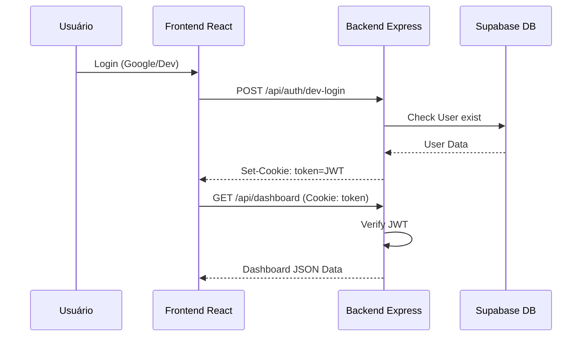

# Architecture Overview - ProductSQUAD Manager

## 1. Diagrama de Alto Nível (Components)

```mermaid
graph TD
  User((Usuário / Stakeholder))
  AppWeb[Frontend React/Vite]
  AppApi[Backend Express/Node]
  DB[(PostgreSQL - Supabase)]
  Cloud((Supabase Cloud))
  
  User -- HTTP/S --> AppWeb
  AppWeb -- JSON/REST --> AppApi
  AppApi -- Prisma ORM --> DB
  DB -- State --> Cloud
  
  subgraph Monorepo (Turborepo)
    AppWeb
    AppApi
  end
  
  subgraph Data Layer
    DB
  end
```

## 2. Estrutura de Diretórios (Workspaces)

```text
/
├── apps/
│   ├── api/            # Backend Express + Prisma Client
│   │   ├── prisma/     # Database Schema & Migrations
│   │   ├── src/        # Controllers, Routes, Middlewares
│   │   └── package.json
│   └── web/            # Frontend React + Tailwind
│       ├── src/        # Components (Gantt, Sidebar, etc.), Pages, Hooks
│       └── package.json
├── package.json        # Root workspace configuration
└── turbo.json          # Turborepo task management
```

## 3. Fluxo de Autenticação (JWT)



## 4. Estratégia de Deploy & CI/CD
- **Infra**: Provisionamento via **Supabase** (Postgres + Auth).
- **Frontend**: Podendo ser hospedado via Vercel ou Netlify (build `npm run build` do `apps/web`).
- **Backend**: Containerizado ou hospedado via PaaS (Heroku, Render, AWS App Runner).
- **Migrations**: `npx prisma migrate deploy` executado no pipeline de CD para atualizar o ambiente de PRD.

## 5. Convenções Técnicas
- **Naming**: `PascalCase` para Componentes, `camelCase` para funções e variáveis.
- **State**: `useState` para estados locais, `Context API` para estados globais leves.
- **Styling**: **Tailwind CSS** (Utility-first) com foco em redução de espaçamentos e layouts densos.
- **SDD Pattern**: O desenvolvimento é orientado por especificações rigorosas registradas no PRD/SDR.
